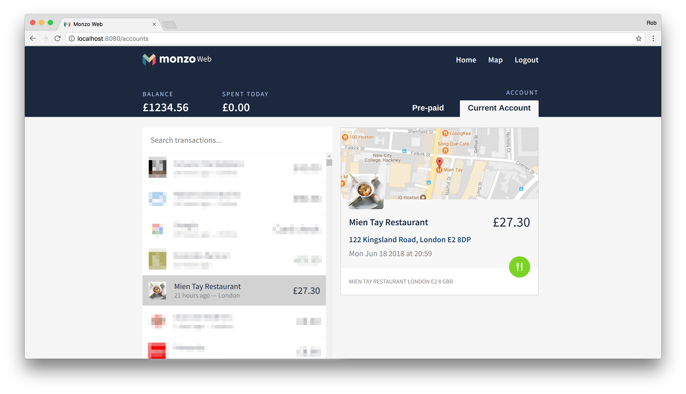

# :moneybag: Monzoweb
View your Monzo account from your browser and view all your transactions on an interactive map!



## Monzo's Monzoweb
In [June 2018, Monzo introduced web.monzo.com](https://monzo.com/blog/2018/06/21/how-to-get-online-in-an-emergency/), a project with similar aims to this one, if you're non technical and or just want to view your transactions and balance in a browser, then [web.monzo.com](https://web.monzo.com) if probably for you. Otherwise keep reading :smile:.

## Getting Started
If you're not a developer or have limited technical knowledge, [this longform, simple setup guide](./SIMPLE.md) will help you setup Monzoweb.

If you're comfortable setting up web projects, just follow these steps:
1. [Install Node.js](https://nodejs.org/en/download/package-manager/)
2. `git clone https://github.com/robcalcroft/monzoweb && cd monzoweb`
3. `npm install` to install dependencies
4. Setup your environment by setting the following variables in a `.env` file:
```
MONZO_CLIENT_ID=...
MONZO_CLIENT_SECRET=...
MONZO_REDIRECT_URI=...
GOOGLE_MAPS_API_KEY=...
PORT=... (this is optional, the API server runs on 8081 by default)
```
For the redirect URI, it should look like: `https://<your domain>/callback`.

See `.env-example` for an example of how the file should look.

You'll also need to grab a Google Maps JavaScript API key, available from https://developers.google.com/maps/documentation/javascript/get-api-key

5. Boot the app with `npm start` which starts the dev server and opens the app in a browser.
6. In another terminal, run the API server with `npm run start:backend` which allows the frontend app to authenticate with Monzo's servers.

## Running the app for personal use
For when you want to use the app without development mode, you can build a static version of the app with `npm run build`. You can then serve the contents of the `dist` directory with something like Nginx. You need to ensure all requests except those starting with `/api` send `index.html` to the client. You can look at `nginx.example.conf` for inspiration. Finally you need to run the API server, I suggest using something like [PM2](http://pm2.keymetrics.io/) to manage the process.

---

__*Only the owner of the Monzo OAuth credentials can sign in using their Monzo account to any OAuth app. This is a constraint from Monzo whilst it is still in beta.__
